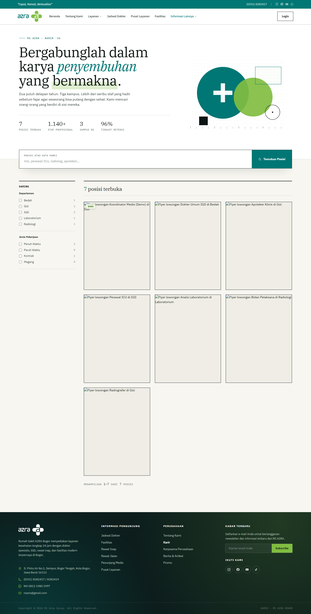
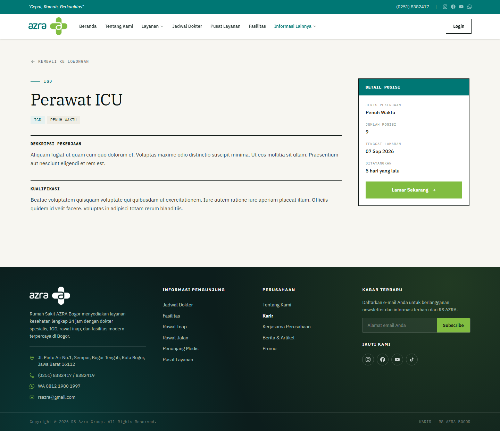
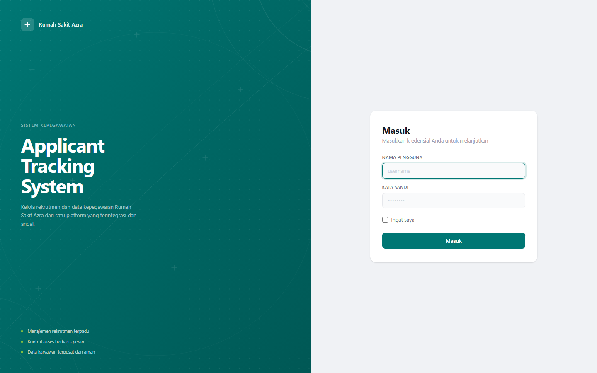
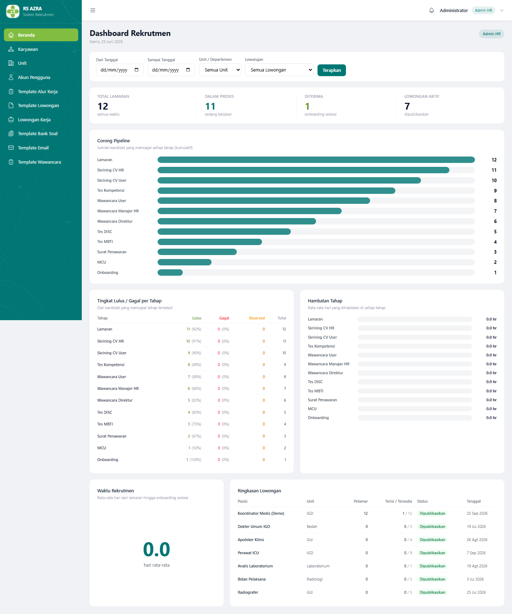
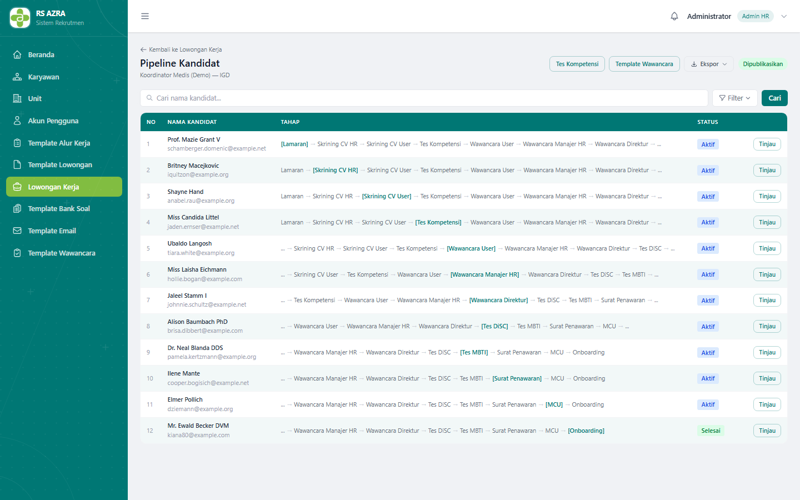
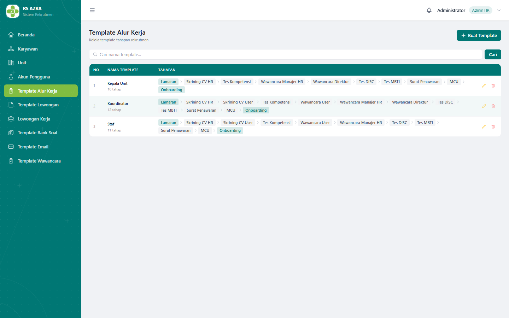
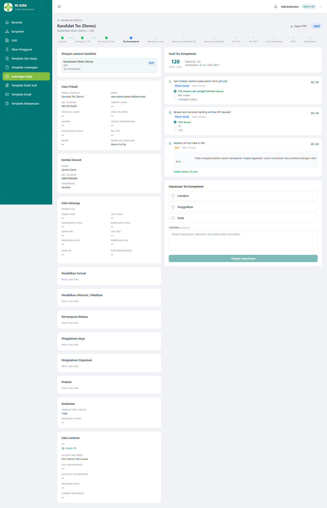
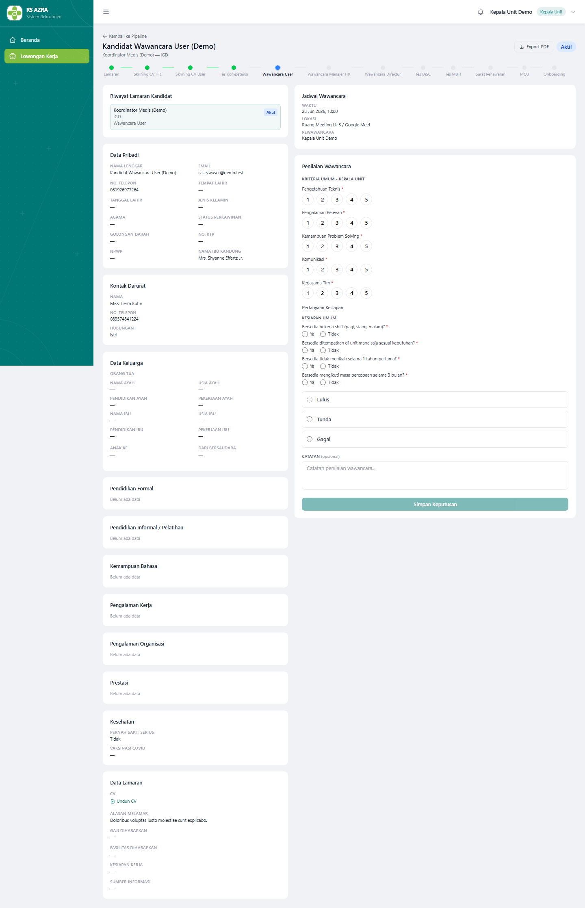
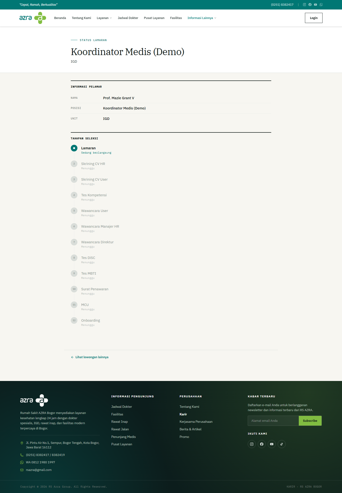

<h1 align="center">Azra ATS</h1>
<p align="center"><strong>Applicant Tracking &amp; Recruitment System for Azra Hospital</strong></p>

<p align="center">
A full recruitment platform that replaces manual hiring (WhatsApp, Google Forms, spreadsheets) with a
single, role-aware pipeline — from a public careers page all the way to onboarding.
</p>

<p align="center">
  
  
  
  
  
  
</p>

> **About this project.** Azra ATS is a real client project built end-to-end during an internship at Azra
> Hospital. It is a production-oriented Laravel application — not a tutorial demo — covering the complete
> recruitment lifecycle plus an employee directory and account management. This README is a portfolio
> overview of what was built and how. The application UI is in Bahasa Indonesia; this document is in English.

---

## The Problem

Hospital recruitment was run by hand: vacancies posted ad hoc, applications collected over WhatsApp and
Google Forms, candidate tracking living in spreadsheets, and no shared view of where any candidate stood.
There was no audit trail, no consistent scoring, and no way to measure the funnel.

## The Solution

A centralized Applicant Tracking System with a **semi-configurable pipeline engine**, role-scoped access
for every internal role, and a fully account-free candidate experience driven by tokenized links. The
system also bundles an employee directory and login/account management for all internal staff.

---

## Key Features

**Recruitment pipeline (ATS)**
- **Semi-configurable workflow engine** — stages can be toggled on/off and reordered per template; the only
  hard constraints are that Application is first and Onboarding is last. Ships with three templates
  (Coordinator, Staff, Head Unit).
- **12-stage pipeline** — Application → HR CV Screening → Unit CV Screening → Competency Test →
  Unit Interview → HR Manager Interview → Director Interview → DiSC → MBTI → Offering Letter → MCU → Onboarding.
- **Pass / Fail / Reserved** decisions at every screening and interview stage, with notes. Forward-only
  movement (no backward transitions). "Reserved" candidates auto-reject at the vacancy deadline.
- **Pipeline board** — every candidate for a vacancy with their position across all stages at a glance.
- **Candidate callback** — applicants who failed a previous period for the same job template can be invited
  to re-apply, closing the loop (failed → invited → re-applied).

**Assessments**
- **Competency test engine** — domain-specific question bank per department, multiple-choice (auto-scored)
  plus essays (manual review), timed.
- **DiSC and MBTI** personality tests — built in-system, auto-scored, informational (not shown to candidates).
- **Structured interviews** — 1–5 ratings per criterion plus readiness questions; global default templates
  with per-vacancy override.

**Candidate experience (no account)**
- Public careers page with vacancy list and detail.
- Multi-step personal-data application form with per-section conditional validation and CV upload.
- **Tokenized read-only status page** so candidates track their application without logging in.
- Tokenized test links and **signed** offer-response links (accept/reject) delivered by email.

**Administration**
- **Role-scoped dashboards** — HR Admin sees the whole organization; Unit Heads, HR Manager, Director, and
  unit employees see only their scope (funnel, pass/fail rates, stage bottlenecks, time-to-hire).
- **Reusable templates** — workflows, vacancies, interview criteria, question banks, and email templates.
- **Email automation** — editable global templates with placeholders, sent automatically on stage transitions.
- **Reporting & exports** — recruitment funnel, candidate list export (Excel/CSV), and per-candidate PDF.
- **Employee directory** and **account management** (every employee gets a login; default password changed
  on first login).

---

## Screenshots

A curated set is shown below. The **[full visual walkthrough (51 screenshots, every stage)](docs/alur-sistem/README.md)**
documents the entire flow step by step.

| Public careers page | Vacancy detail |
|---|---|
|  |  |

| Login | HR Admin dashboard |
|---|---|
|  |  |

| Pipeline board | Workflow engine (configurable stages) |
|---|---|
|  |  |

| Competency test — scored | Structured interview scoring |
|---|---|
|  |  |

| Candidate status (tokenized, no account) |
|---|
|  |

---

## Engineering Highlights

- **Pipeline-as-data workflow engine.** Stages are configurable records, not hardcoded `if`-chains, which
  makes the hiring process editable per vacancy without code changes.
- **Template snapshots.** When a vacancy is published, its workflow, interview criteria, and test questions
  are snapshotted — later edits to a template never mutate in-flight candidates' history.
- **Role-scoped data access.** A single dashboard and pipeline adapt to the viewer's role and unit;
  documented in [ADR 0003](docs/adr/0003-role-scoped-dashboard.md).
- **Account-free candidate flow.** Status, tests, and offer responses are reachable only via tokenized
  (and, for offers, cryptographically **signed**) URLs — no candidate accounts to manage or secure.
- **Architecture Decision Records.** Non-obvious choices are written down under
  [`docs/adr/`](docs/adr/) (job-template/vacancy split, failed-candidate callback, role-scoped dashboard).
- **Test coverage across the lifecycle.** Feature and unit tests cover applications, screening, the
  competency engine, DiSC/MBTI scoring, interviews, offers/MCU/onboarding, callbacks, exports, auth, role
  middleware, and rate limiting.

### By the numbers

| | |
|---|---|
| Eloquent models | 50+ |
| Test suites (PHPUnit feature + unit) | 35 |
| Documented pipeline stages | 12 |
| Internal roles + account-free candidate | 4 + 1 |
| Documented UI screens | 51 |
| Architecture Decision Records | 3 |

---

## Tech Stack

| Layer | Technology |
|---|---|
| Framework | Laravel 12 (PHP 8.3) |
| Frontend | Blade, Tailwind CSS 4, Alpine.js, Vite |
| Database | PostgreSQL |
| Auth | Laravel Fortify (username/password); tokenized + signed links for candidates |
| PDF | `barryvdh/laravel-dompdf`, `iio/libmergepdf` (per-candidate PDF export) |
| Spreadsheets | `maatwebsite/excel` (candidate list export) |
| Tooling | Pint (formatting), PHPUnit (tests), Pail (logs), Sail (containers) |
| Deployment | VPS; local file storage, S3-ready via Laravel filesystem |
| Language | Application UI in Bahasa Indonesia |

---

## Getting Started

**Requirements:** PHP 8.3, Composer, Node.js, PostgreSQL.

```bash
# 1. Install dependencies
composer install
npm install

# 2. Environment
cp .env.example .env
php artisan key:generate
# set DB_CONNECTION=pgsql and your Postgres credentials in .env

# 3. Database
php artisan migrate --seed

# 4. Build assets
npm run build      # or: npm run dev

# 5. Run
php artisan serve  # or: composer run dev (serve + queue + logs + vite)
```

**Demo data & accounts.** To reproduce the documented walkthrough — a "Koordinator Medis (Demo)" vacancy
with one candidate at every stage — seed the demo data:

```bash
php artisan db:seed --class=DummyCandidateSeeder
```

Demo logins (password `password`): `admin` (HR Admin), `kepala_unit` (Unit Head), `hr_manager` (HR Manager),
`direktur` (Director), `staff_demo` (Employee). Full reproduction steps are in the
[walkthrough appendix](docs/alur-sistem/README.md#lampiran--membuat-ulang-data--tangkapan-layar).

**Tests**

```bash
php artisan test --compact
```

---

## Project Structure

```
app/                  Models, controllers, services (DiSC/MBTI scoring, email notifications)
database/             Migrations, factories, seeders (incl. demo seeders)
docs/
  adr/                Architecture Decision Records
  alur-sistem/        Full visual walkthrough (51 screenshots) + system-flow doc
resources/views/      Blade templates (Tailwind CSS + Alpine.js)
tests/                PHPUnit feature & unit suites
scripts/              Playwright screenshot driver, PDF builder
```

---

## Author

Built by **[@akbarmaulanad22](https://github.com/akbarmaulanad22)** during an internship at Azra Hospital.
